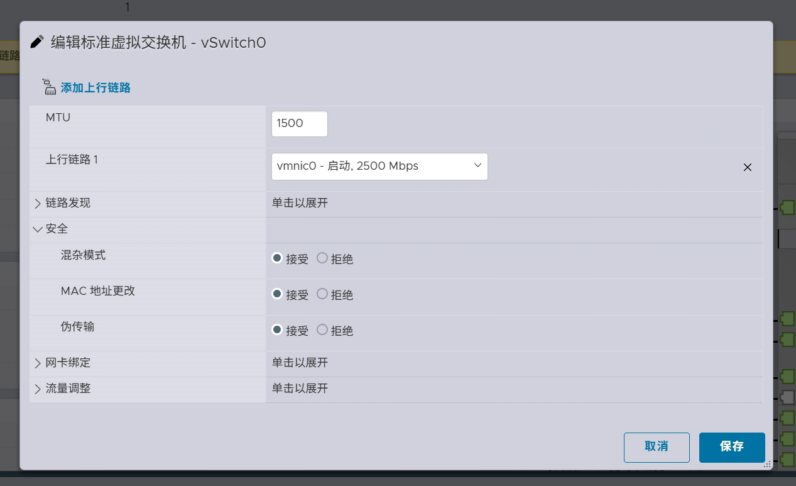

# K8s 集群搭建

本文介绍如何搭建支持 CBCTF 容器题目的 Kubernetes 集群。若仅使用问答题和静态题，可跳过本节直接使用 [Docker 部署](/docs/deploy/docker) 或 [二进制部署](/docs/deploy/binary)。

## 硬件要求

准备多台运行 Ubuntu 22.04+ 的 Linux 服务器，分为：

- **Master 节点** × 1：管理 K8s 控制平面
- **Worker 节点** × N：运行题目容器（建议至少 2 台）

### VMware ESXi 说明

若使用 ESXi 虚拟机，需在 vSwitch 上开启混杂模式（`Promiscuous Mode`）和 MAC 地址更改（`MAC Address Changes`），否则 VPC 网络无法正常工作。



> 不支持 macvlan 的云服务商（如大多数公有云 VPS）**无法使用 VPC 网络模式**部署靶机，仅可使用 Pod 网络模式。

### 网卡命名一致性

所有节点的主网卡（连接外部网络的网卡）**名称必须相同**，例如均为 `eth0`。否则可能导致部分节点上的靶机无法访问外部网络。修改方式请自行搜索对应 Linux 发行版的配置方法。

## 安装 NFS 客户端

在所有节点上安装 NFS 相关软件包，以支持 Kubernetes NFS 共享存储挂载：

```bash
sudo apt update
sudo apt install -y nfs-common
```

## 安装 K3S

CBCTF 推荐使用 [K3S](https://docs.k3s.io/) 作为 Kubernetes 发行版，轻量易部署。

### Master 节点

安装 K3S 并禁用默认的 Flannel 网络插件（由 KubeOVN 接管）：

```bash
curl -sfL https://rancher-mirror.rancher.cn/k3s/k3s-install.sh | \
  INSTALL_K3S_MIRROR=cn sh - --flannel-backend=none --disable-network-policy
```

安装完成后，集群凭证位于 `/etc/rancher/k3s/k3s.yaml`，节点 Token 位于 `/var/lib/rancher/k3s/server/node-token`。

### Worker 节点

将 `myserver` 替换为 Master 节点 IP，`mynodetoken` 替换为上述 Token：

```bash
curl -sfL https://rancher-mirror.rancher.cn/k3s/k3s-install.sh | \
  INSTALL_K3S_MIRROR=cn \
  K3S_URL=https://myserver:6443 \
  K3S_TOKEN=mynodetoken \
  sh - --flannel-backend=none --disable-network-policy
```

推荐使用 [Lens](https://k8slens.dev/) 对集群进行可视化管理。

## 安装 Multus CNI

[Multus CNI](https://github.com/k8snetworkplumbingwg/multus-cni) 为 Pod 提供多网卡支持，VPC 网络模式必须安装。

### Thin Plugin（推荐）

```bash
kubectl apply -f https://raw.githubusercontent.com/k8snetworkplumbingwg/multus-cni/master/deployments/multus-daemonset.yml
```

### Thick Plugin（不推荐）

Thick Plugin 存在以下已知问题，可能导致集群不稳定：

- [OOMKilled 问题](https://github.com/k8snetworkplumbingwg/multus-cni/issues/1346)
- [Text file busy 问题](https://github.com/k8snetworkplumbingwg/multus-cni/issues/1221)

如仍需使用，请参考 [Issue #1346](https://github.com/k8snetworkplumbingwg/multus-cni/issues/1346#issuecomment-2644110944) 和 [PR #1213](https://github.com/k8snetworkplumbingwg/multus-cni/pull/1213) 中的解决方案。

```bash
kubectl apply -f https://raw.githubusercontent.com/k8snetworkplumbingwg/multus-cni/master/deployments/multus-daemonset-thick.yml
```

## 安装 Kube-OVN

[Kube-OVN](https://kubeovn.github.io/docs/stable/) 提供 VPC 网络隔离功能。推荐使用 v1.14.5 版本。

在 Master 节点执行：

```bash
wget https://raw.githubusercontent.com/kubeovn/kube-ovn/refs/tags/v1.14.5/dist/images/install.sh
bash install.sh
```

如需自定义参数，参考[官方安装文档](https://kubeovn.github.io/docs/stable/start/one-step-install/)。

## 配置 StorageClass

> **仅 K3S 需要此步骤**，原生 K8s 可跳过。

动态附件题目需要使用支持 `ReadWriteMany` 的 StorageClass（如 NFS）。K3S 默认的 `local-path` 不支持 RWX，需取消其默认 StorageClass 标记：

```yaml
# 修改 local-path StorageClass 的 annotation
storageclass.kubernetes.io/is-default-class: 'false'
```

然后安装并配置支持 RWX 的 StorageClass（如 [NFS Subdir External Provisioner](https://github.com/kubernetes-sigs/nfs-subdir-external-provisioner)），并将其设为默认 StorageClass。

## 跨云厂商节点

部分节点来自不支持 VPC 网络的云厂商时，需为其打上污点，防止 VPC 题目容器调度到这些节点：

```bash
kubectl taint node <node-name> vpc-network=unacceptable:NoSchedule
```

只有包含 VPC 网络配置的题目容器才会受此污点影响；Pod 网络模式的题目不受限制。
