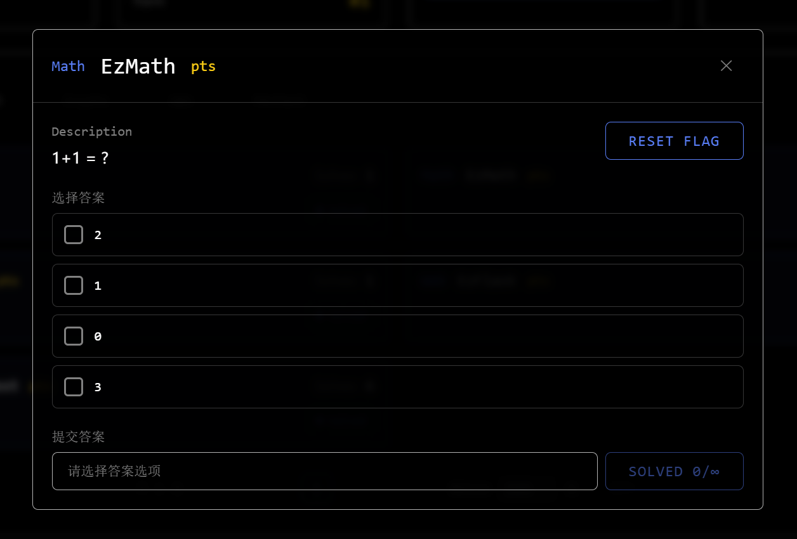
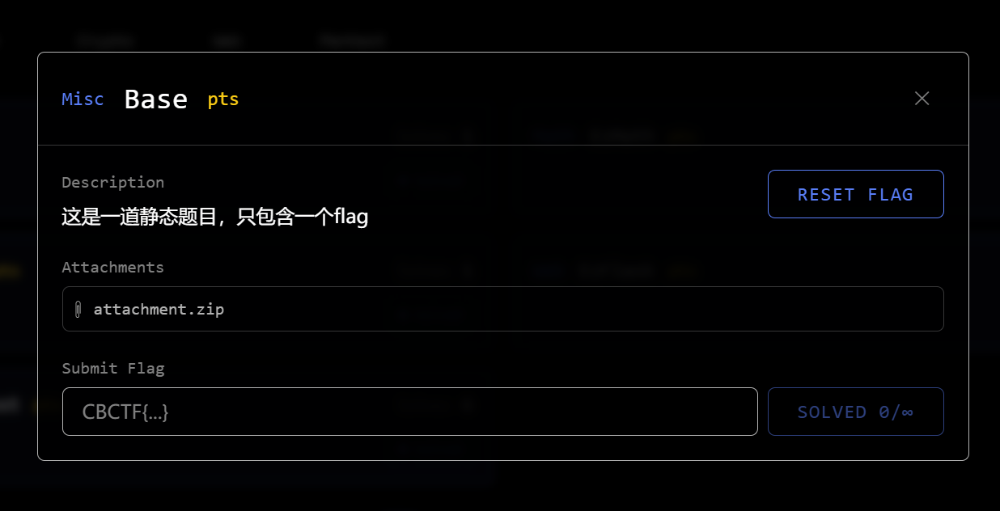
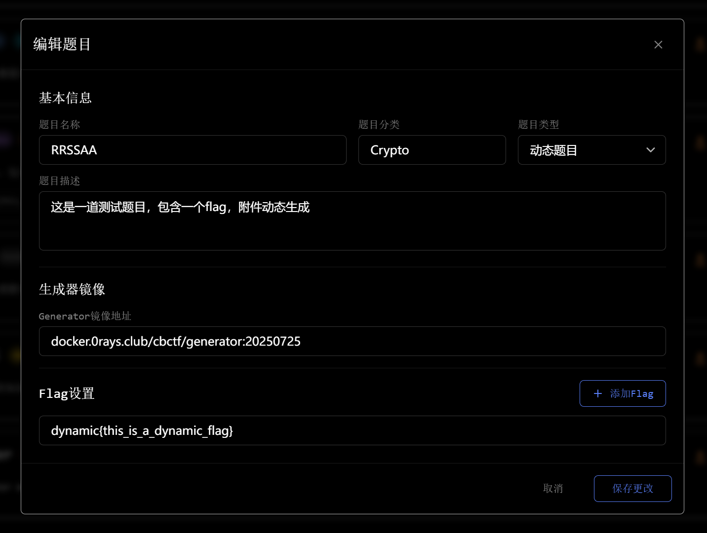
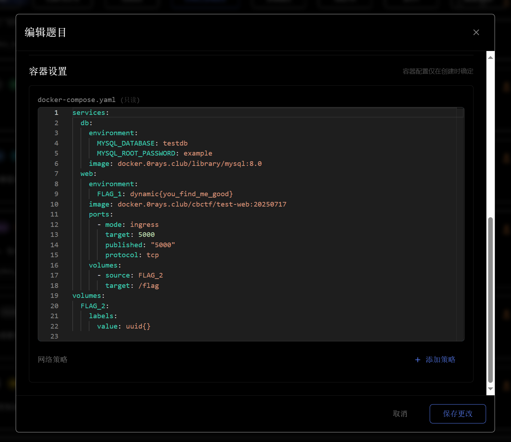

# 题目类型

CBCTF 支持四种题目类型，覆盖从简单知识问答到复杂网络靶机的完整场景。

## 类型概览

| 特性 | 问答题 | 静态题 | 动态附件题 | 容器题 |
|------|:------:|:------:|:----------:|:------:|
| 类型标识 | `question` | `static` | `dynamic` | `pods` |
| 共享静态附件 | ✓ | ✓ | — | ✓ |
| per-team 动态附件 | — | — | ✓ | — |
| 静态 Flag | ✓ | ✓ | ✓ | ✓ |
| 动态 Flag | — | — | ✓ | ✓ |
| UUID Flag | — | — | ✓ | ✓ |
| 容器靶机 | — | — | — | ✓ |
| 需要 Kubernetes | — | — | ✓ | ✓ |

## 问答题（question）

问答题为选项题形式，每个选项都有对应的内容。选手选择正确选项后提交，由平台自动判分。

flag 类型必须为 `static{}`（所有选手答案相同）。适合知识点考查、谜题类题目。

## 静态题（static）

静态题为最简单的 CTF 传统题型，题目附件和 flag 对所有队伍相同。

- 上传静态附件（zip 格式），所有队伍共享下载
- flag 使用 `static{}` 类型（所有队伍相同），也支持 `dynamic{}` 和 `uuid{}`（每队不同，但无法通过附件向选手传达个人 flag）
- 不需要 Kubernetes

## 动态附件题（dynamic）

动态附件题为每支队伍独立生成附件，通常配合动态 flag 使用，防止抄答案。

- 需要出题人编写生成器 Docker 镜像，平台在 Kubernetes 中运行生成器容器
- 附件按队伍独立生成，每支队伍下载不同的 zip
- flag 类型支持 `static{}`、`dynamic{}`、`uuid{}`
- 需要 Kubernetes 集群

详见 [动态附件生成](/docs/features/attachment)。

## 容器题（pods）

容器题为每支队伍部署独立的靶机容器，由出题人编写 `docker-compose.yaml` 配置。

- 每队拥有独立的容器实例，互不干扰
- 支持 Pod 网络模式（简单多容器）和 VPC 网络模式（复杂网络拓扑）
- flag 通过环境变量或文件 volume 注入容器
- 需要 Kubernetes 集群（VPC 模式还需要 KubeOVN + Multus）

详见 [容器靶机](/docs/features/container)。

## 题目测试模式

管理员可在将题目加入比赛之前，通过题目测试模式（需 `admin:challenge:test` 权限）启动/停止容器靶机进行验证，无需创建队伍。

详见 [题目管理 - 题目测试模式](/docs/admin/challenges#题目测试模式)。
